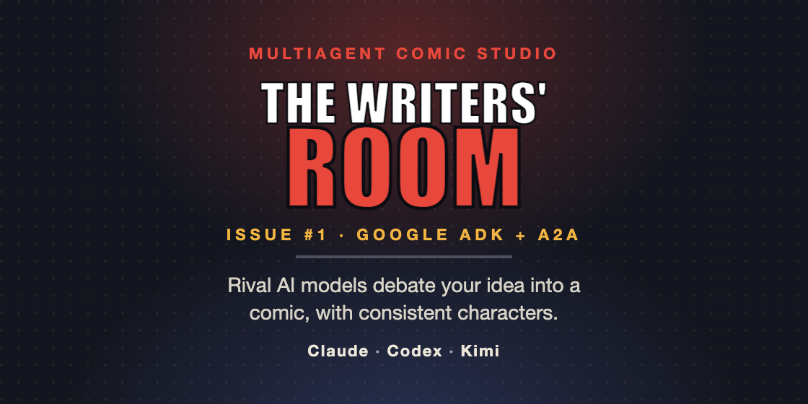
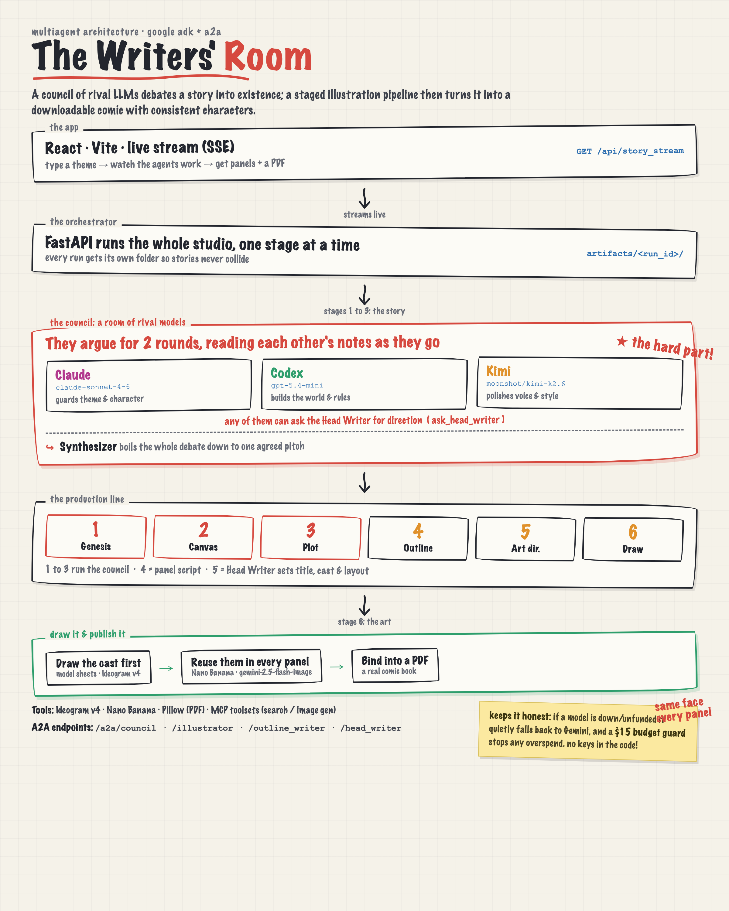

# The Writers' Room



A multi agent comic studio: a council of rival LLMs debates your idea into a story, then a staged illustration pipeline turns it into a comic with consistent characters and a downloadable PDF. Built on the Google Agent Development Kit (ADK) and the Agent to Agent (A2A) protocol.

**Live demo:** https://story-generator-ui-352241932029.us-east1.run.app

---

## The Problem

Turning a one line idea into a finished comic is not one task, it is a studio. Real comics are made by a room of specialists who argue: an editor guards theme, a world builder keeps the rules consistent, a stylist polishes the prose, an outline writer breaks the story into panels, and an illustrator draws a cast that must look the same in every frame. A single LLM prompt collapses all of that into one voice, with no genuine disagreement and, critically for comics, no consistency of characters across generated images.

## The Solution

You type a theme and genre, and watch a studio of agents build your comic live over a streaming feed. The output is a set of illustrated, captioned panels and a Marvel/DC style PDF comic (a cover page, then pages of panels with a caption box beneath each). The pipeline runs autonomously in six stages: Genesis, Room and Canvas, Breaking the Story, Master Outline, Art Direction, and Illustration and Publishing.

## Architecture



The system is built on Google ADK and exposes each major agent over the A2A protocol through FastAPI. A React (Vite, TypeScript) frontend drives it through a live stream (SSE).

- **The Council** is an ADK `SequentialAgent` wrapping a `LoopAgent`. Three debaters (Claude, Codex, Kimi) argue for two rounds, each reacting to the others through the shared session, and a Gemini synthesizer distills the debate into one consensus. Any debater can call an `ask_head_writer` tool for direction.
- **Character consistency:** the illustrator draws a clean model sheet for each character first, then generates every panel conditioned on those sheets (via Nano Banana, `gemini-2.5-flash-image`) so the same faces and costumes recur across the comic. Ideogram v4 draws the model sheets; Pillow is the last resort fallback and the PDF renderer.
- **Per run isolation:** every run writes to its own `artifacts/<run_id>/` folder so concurrent stories never collide.

## Key Concepts Demonstrated

- **Agent and multi agent system (ADK):** the council (`SequentialAgent` + `LoopAgent` + synthesizer), specialized agents, and A2A served endpoints.
- **MCP Server:** the illustrator dynamically loads MCP toolsets when configured (a Chrome/Brave search server over Stdio, and an image generation MCP over Stdio or remote SSE).
- **Security features:** a `BudgetGuard` plugin enforces a hard $15 spend cap across all model calls in a session; no API keys live in code (everything is read from a git ignored `.env`); providers are isolated so a failing one cannot take over a run.
- **Deployability:** an Agents CLI manifest and a Dockerfile deploy to Google Cloud Run (see below).
- **Agent skills (Agents CLI):** the project is scaffolded and managed with the ADK Agents CLI (`agents-cli-manifest.yaml`).

## Tech Stack

| Layer | Technologies |
|---|---|
| Agents | Google ADK, A2A protocol, LiteLLM |
| Models | Gemini (coordinators/synthesizer/layout), Claude Sonnet 4.6, GPT 5.4 mini, Kimi K2.6 |
| Backend | Python, FastAPI, Server Sent Events |
| Images | Ideogram v4, Nano Banana (`gemini-2.5-flash-image`), Pillow (placeholder + PDF) |
| Frontend | React, TypeScript, Vite |
| Deploy | Docker, Google Cloud Run, Terraform |

## Project Structure

```
app/                 ADK agents (agent.py), FastAPI pipeline (fast_api_app.py), tools (tools.py)
frontend/            React + Vite UI (src/App.tsx)
docs/                architecture diagram + card image
deployment/          Terraform for Cloud Run / CICD
tests/               unit + integration tests
WRITEUP.md           project report
```

## Setup (Local)

**Prerequisites:** Python 3.13, [uv](https://docs.astral.sh/uv/), Node.js 18+, and API keys (at minimum a `GEMINI_API_KEY`).

1. **Configure keys.** Copy the example env file and fill in your keys:
   ```bash
   cp .env.example .env
   # edit .env — GEMINI_API_KEY is required; the council keys and IDEOGRAM_API_KEY are optional
   ```
   Any missing or unfunded provider automatically falls back to Gemini, so the app runs with just a Gemini key.

2. **Start the backend** (FastAPI on port 8000):
   ```bash
   uv sync           # or: pip install -r requirements.txt
   uv run python -m app.fast_api_app
   ```

3. **Start the frontend** (Vite on port 5173), in a second terminal:
   ```bash
   cd frontend
   npm install
   npm run dev
   ```
   Open http://localhost:5173 and generate a story.

## Deploy (Google Cloud Run)

The app is a single service that serves both the UI and the `/api` backend. From the project root:

```bash
gcloud run deploy story-generator-ui \
  --source . \
  --region us-east1 \
  --allow-unauthenticated \
  --set-env-vars GEMINI_API_KEY=...,IDEOGRAM_API_KEY=...,ANTHROPIC_API_KEY=...,OPENAI_API_KEY=...,MOONSHOT_API_KEY=...
```

For production, prefer `--set-secrets` (Secret Manager) over `--set-env-vars` for keys, and see `deployment/terraform/` for full infrastructure as code (service accounts, CICD triggers, telemetry). Never commit real keys or service account files (`.env` and `keys/` are git ignored).

## How It Stays Robust

- **Provider resilience:** `get_llm_model()` probes each provider at load and falls back to Gemini if a key is missing, unfunded, or the model id is wrong, so one dead provider never crashes the room.
- **Graceful degradation:** each stage catches errors and falls back (fallback layouts, fallback captions, placeholder art, always a cover) so the pipeline always produces a complete comic.
- **Budget guard:** a session wide $15 cap raises before any overspend.

## Acknowledgements

Built for the 5 Day AI Agents capstone (Freestyle track) with Google ADK. See `WRITEUP.md` for the full project report.
